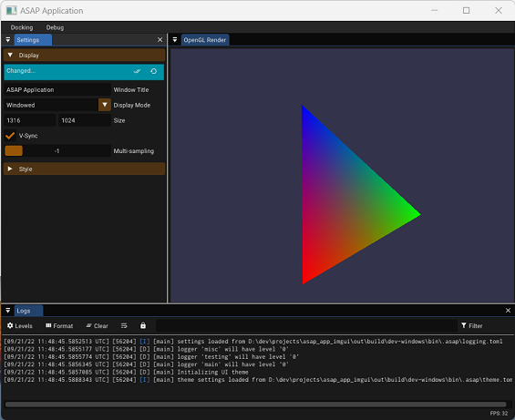

# ImGui Modern C++ and Modern CMake starter project

<div align="center">

-+- Build Status -+-

_develop_

[![Build status - develop][build-status-develop-badge]][build-matrix]

_master_

[![Build status - master][build-status-master-badge]][build-matrix]

-+-

[![Latest release][release-badge]][latest-release]
[![Commits][last-commit-badge]][commits]
[![Linux][linux-badge]][latest-release]
[![Windows][windows-badge]][latest-release]
[![Mac OS][macos-badge]][latest-release]
[![License][license-badge]][license]

</div>

<p align="center">
  <a href="#key-features">Key Features</a> •
  <a href="#project-documentation">Project Documentation</a> •
  <a href="#getting-started">Getting Started</a> •
  <a href="#Contributing">Contributing</a> •
  <a href="#credits">Credits</a> •
</p>

## Key Features

This is a starter project for [ImGui](https://github.com/ocornut/imgui)
development in **Modern** C++ (>= c++-17) and with **Modern** `CMake` (>= 3.14)
based on the [asap](https://github.com/abdes/asap) template.



- `CMake` as the build system with or without presets
- cross-platform portability on Linux, OS X and Windows
- multiple compilers: clang, g++ and MSVC
- modular structure with each module self-contained in a subdirectory within the
  project
- `CMake` build helpers to facilitate declaration of library, exe, test modules,
  for the end-to-end lifecycle including doc generation, test, packaging etc...
- unit testing targets, with by default Google Test as the framework (other
  frameworks are also possible)
- code coverage with clang or g++
- zero-touch valgrind, clang-tidy, clang-format, google sanitizers, etc
- development can be done locally or in a dev container with vscode
- faster rebuilds with [`ccache`](https://ccache.dev) compiler caching
- `CMake` package management with [`CPM`](https://github.com/cpm-cmake/CPM.cmake)
- ImGui with docking, GLM, GLFW, and an example simple application, so you can
  get started immediately
- persistence of ImGui and docks configuration

> _If you miss the old version of this starter project (you can't move to cxx-17 or
you just can't bother), it is still in the
[old_cxx](https://github.com/abdes/asap_app_imgui/tree/old_cxx) branch of this
repo._
>
> _It is no longer updated though._

## Project Documentation

We have detailed guides for setting up an efficient development environment, the
development process, project structure, etc. Take a look at the available guides
[here](https://abdes.github.io/asap/asap_master/html/).

In addition to that, specific documentation for this project, its application
modules, its usage and APIs, are provided in the project GitHub Pages site
[here](https://abdes.github.io/asap_app_imgui/asap_app_imgui_master/html/index.html).

## Getting Started

It is strongly recommended that you take some time to browse the project
documentation to familiarize yourself with its structure and development
workflows.

Make sure you have a C++ compiler with C++-17 capabilities at least. Gnu, Clang
and MSVC all can do that with a recent version.

```bash
git clone --recurse-submodules -j4 https://github.com/abdes/asap_app_imgui.git
```

```bash
mkdir _build && cd _build && cmake .. && cmake --build .
```

or just use one of the predefined `CMake` presets. Detailed instructions are in
the project documentation, and many useful commands are listed
[here](https://abdes.github.io/asap/asap_master/html/getting-started/useful-commands.html).

### Running the demo

1. Run the app from within the build directory (./asap_app)
2. Drag and drop the frames to dock them to whichever side you want.
3. Edit the settings as you wish
4. When the app is closed, the settings, docks, loggers, etc are saved into
   the .asap directory under the build directory. Some files saved by ImGui
   are still under the build directory directly (work in progress)

You need to have a graphics system capable of providing OpenGL 3.2 to properly
run the demo.

## CMake configurable build options

```cmake
# Project options
option(BUILD_SHARED_LIBS        "Build shared instead of static libraries."              ON)
option(ASAP_BUILD_TESTS         "Build tests."                                           OFF)
option(ASAP_BUILD_EXAMPLES      "Build examples."                                        OFF)
option(ASAP_WITH_GOOGLE_ASAN    "Instrument code with address sanitizer"                 OFF)
option(ASAP_WITH_GOOGLE_UBSAN   "Instrument code with undefined behavior sanitizer"      OFF)
option(ASAP_WITH_GOOGLE_TSAN    "Instrument code with thread sanitizer"                  OFF)
option(ASAP_WITH_VALGRIND       "Builds targets with valgrind profilers added"           OFF)
```

## Contributing

If you would like to contribute code you can do so through GitHub by forking the
repository and sending a pull request. When submitting code, please make every
effort to follow existing conventions and style in order to keep the code as
readable as possible.

By contributing your code, you agree to license your contribution under the
terms of the BSD-3-Clause or a more permissive license. All files are released
with the BSD-3-Clause license.

Read the [developer guides](https://abdes.github.io/asap/asap_master/html/).

### Submitting a PR

- For every PR there should be an accompanying issue which the PR solves
- The PR itself should only contain code which is the solution for the given
  issue
- If you are a first time contributor check if there is a suitable issue for you

## Getting updates from upstream [`asap`](https://github.com/abdes/asap)

In order to pull and merge updates from the upstream project, make sure to add
it to the repo's remotes and disable pulling/merging tags from the upstream. We
want tags to be limited to those made in this repo, not in the upstream.

```bash
git remote add upstream https://github.com/abdes/asap.git
git config remote.upstream.tagopt --no-tags
```

## Credits

- The multitude of other open-source projects used to implement this project or
  to get inspiration - credits in the source code or the documentation as
  appropriate

[build-matrix]: https://github.com/abdes/asap_app_imgui/actions/workflows/cmake-build.yml
[build-status-develop-badge]: https://github.com/abdes/asap_app_imgui/actions/workflows/cmake-build.yml/badge.svg?branch=develop
[build-status-master-badge]: https://github.com/abdes/asap_app_imgui/actions/workflows/cmake-build.yml/badge.svg?branch=master
[commits]: https://github.com/abdes/asap_app_imgui/commits
[last-commit-badge]: https://img.shields.io/github/last-commit/abdes/asap_app_imgui
[latest-release]: https://github.com/abdes/asap_app_imgui/releases/latest
[license-badge]: https://img.shields.io/github/license/abdes/asap_app_imgui
[license]: https://opensource.org/licenses/BSD-3-Clause
[linux-badge]: https://img.shields.io/badge/OS-linux-blue
[macos-badge]: https://img.shields.io/badge/OS-macOS-blue
[release-badge]: https://img.shields.io/github/v/release/abdes/asap_app_imgui
[windows-badge]: https://img.shields.io/badge/OS-windows-blue
