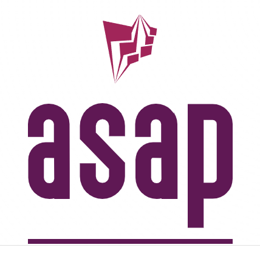

# Starter project for C++ with cmake



[](https://github.com/abdes/asap/actions/workflows/cmake-build.yml)

## [Project Documentation](https://abdes.github.io/asap/asap_master/html/)

## Overview

- `CMake` as the build system with or without presets
- cross-platform portability on Linux, OS X and Windows
- multiple compilers: clang, g++ and MSVC
- modular structure with each module self-contained in a subdirectory within the project
- `CMake` build helpers to facilitate declaration of library, exe, test modules, for the
  end-to-end lifecycle including doc generation, test, packaging etc...
- common facilities (common module) for platform specifics, assertions support, logging
- unit testing with Google Test
- code coverage with clang or g++
- zero-touch valgrind, clang-tidy, clang-format, google sanitizers, etc.
- development can be done locally or in a dev container with vscode.

## Getting the code

```bash
git clone --recurse-submodules -j4 https://github.com/abdes/asap.git
```

NOTES:

- -j4 requests git to parallelize cloning of repos. Needs a relatively recent version of git. If
  that is not available, simply do not use this option.

## Requirements

Make sure you have a C++ compiler with C++-17 capabilities at least. Gnu, Clang and MSVC all can do
that with a recent version.

## Enabling husky/commitlint/standard-version

Only one time after the project is cloned, do the following:

```bash
npx husky install
npm install -g @commitlint/cli @commitlint/config-conventional
npm install -g standard-version
```

## Building

```bash
mkdir _build && cd _build && cmake .. && cmake --build .
```

or just use one of the predefined `CMake` presets. Detailed instructions and
many useful commands are listed
[here](https://abdes.github.io/asap/asap_master/html/getting-started/useful-commands.html).

### CMake configurable build options

```cmake
# Project options
option(BUILD_SHARED_LIBS        "Build shared instead of static libraries."              ON)
option(ASAP_BUILD_TESTS         "Build tests."                                           OFF)
option(ASAP_BUILD_EXAMPLES      "Build examples."                                        OFF)
option(ASAP_WITH_GOOGLE_ASAN    "Instrument code with address sanitizer"                 OFF)
option(ASAP_WITH_GOOGLE_UBSAN   "Instrument code with undefined behavior sanitizer"      OFF)
option(ASAP_WITH_GOOGLE_TSAN    "Instrument code with thread sanitizer"                  OFF)
option(ASAP_WITH_VALGRIND       "Builds targets with valgrind profilers added"           OFF)
```
