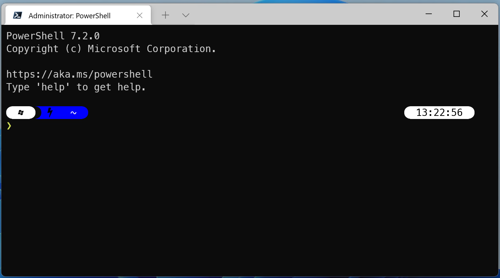

.. Structure conventions
     # with overline, for parts
     * with overline, for chapters
     = for sections
     - for subsections
     ^ for sub-subsections
     " for paragraphs

***********************
Development environment
***********************

.. |date| date::

Last Updated on |date|

In the past, software development comes with a lot of pain. It takes many steps
beginning from Coding, Compiling, Testing, Debugging, Build, and Deployment. All
these different phases would need many commands, scripts and different packages
to be installed and was difficult to maintain by a Developer.

Luckily, most of these activities are now integrated or combined into single
environments known as IDE (Integrated Development Environment), which made
modern software development more productive and more fun. A typical IDE today
provides several essential features such as **syntax highlighting**, **auto-code
completion**, **search and replace**, **refactoring**, **compiler integration**,
**debugging**, **version control**, **build** and **deployment** etc.

Developers tend to be quite opinionated when it comes to selecting the IDE, the
source code editor, automation tools, etc. Therefore, it is not the intent here
to force a certain toolkit but rather to provide a coherent project structure
and build system that can work in any environment while staying simple and
easily maintainable. If you are starting as a C++ developer then the
recommendations provided here will get you started faster. If you are an
experienced developer, it is always important to understand the rationale behind
some of the choices made in the `asap` project so that you can own the design
and adapt it to your specific needs.

Requirements overview
=====================

- **This is a starter project** and as such, starting a new project based on `asap` should be a
  straightforward and simple task. The process should be automated when
  possible, customization should be clearly indicated when relevant and by
  default the starting project should work out of the box.
- **Onboarding of new developers** on the project should be easy. When it makes
  sense, conventions and best practices should be implemented in the tooling,
  not the docs.
- The overall goal is to create an environment for developing software
  *primarily* in C++ but it is often the case that scripts, tools and even
  system modules may be developed in other languages.
- Development may target multiple Operating Systems and developers may use
  different desktop environments. At a minimum, it should be possible to develop
  for/on **Windows 10+**, **Linux**, and **Mac OS X**.
- The build system should provide support for implementing and **automating**
  most of the steps of the development lifecycle including system build,
  documentation generation, deployment package creation, software quality checks
  (linting, static analysis, testing, metrics).
- The tools used and automation scripts may be invoked in an **interactive
  terminal** session or in a completely hands-free CI (**Continuous
  Integration**) environment.

Choices made and rationale
==========================


.. note::
  :class: margin

  These are the fundamental choices made in ` asap` that significantly influence
  its design and impact the extent to which it achieves the goals. There are
  many other small choices made which will be encountered in the build scripts,
  coding standards, style, etc... which are documented in the relevant places.
  None of these choices is cast in stone and they all can be changed or simply
  eliminated.

Choices were made in the design of the `asap` starter project, some of them are
hard choices, and some are more flexible. Nothing is cast in stone in software
development but some decisions will require more effort than others to change.
The table below summarizes such decisions:

.. list-table::
  :widths: 40 60
  :header-rows: 1

  * - Decision
    - Rationale

  * - Version control: **git**
    - It's just the most widely used VCS and the one that works with github,
      gitlab, etc.

      **Variability**: Not recommended.

      You can use a different one if you want, but you will need to adapt the
      versioning and release management tooling and slightly modify the build
      scripts.

  * - Build system: **CMake**
    - We need a system that works across platforms and IDEs and that can allow
      us to easily reuse existing OpenSource software projects. The C++
      ecosystem is seriously lacking the diversity we can find for other
      languages, but CMake emerges as the community choice for now. The `2021
      C++ ecosystem survey
      <https://www.jetbrains.com/lp/devecosystem-2021/cpp/#Which-project-models-or-build-systems-do-you-regularly-use>`_
      puts CMake at the top with **55%** market share.

      **Variability**: None.

  * - Compilers: **Clang, GCC, MSVC**
    - All three most used compilers are tested and work well with `asap`.
      `Clang` is also used for linting and static code analysis and as such
      occupies a more strategic place among compilers.

      **Variability**: Possible.

      As long as the compiler kit is supported by `CMake` it is pretty
      straightforward to add support for it. Some changes may be required in the
      CMake scripts to customize compiler options, flags, etc...

  * - Documentation: **Doxygen**
    - `Doxygen <https://www.doxygen.nl/index.html>`_ is the de-facto standard
      for C++ API documentation and is fully supported/integrated in the build
      system. It can generate documentation in multiple formats, and most
      importantly as XML which is used to generate the integrated project
      documentation with `sphinx`.

      **Variability**: Possible.

      The use of doxygen is completely optional, and can be configured on a
      per-module basis. Full customization of the documentation generated is
      possible via the project-wide configuration file. A HTML theme is provided
      via `Doxygen Awesome <https://jothepro.github.io/doxygen-awesome-css/>`_
      which can be easily customized or replaced if needed.

  * - Documentation: **sphinx**
    - Project documentation may extend beyond APIs to include architecture,
      design, guides, etc. The OpenSource ecosystem has multiple alternatives
      for writing such documentation including `markdown`, `restructuredText`,
      `html`, `ascii`, and many variations of them.

      `asap` recommends and has full support for **restructuredText** via
      **sphinx**. `reStructuredText` is an easy-to-read,
      what-you-see-is-what-you-get plaintext markup syntax and parser system. It
      is useful for in-line program documentation (such as Python docstrings),
      for quickly creating simple web pages, and for standalone documents.
      `reStructuredText` is the default plaintext markup language used by
      `Sphinx`.

      `Sphinx <https://www.sphinx-doc.org/en/master/index.html>`_ can generate documentation in many
      formats including HTML and has many useful extensions to augment its functionality. Among such
      extensions, `Breathe <https://breathe.readthedocs.io/en/latest/>`_ can be used to integrate
      API documentation generated by `doxygen`.

      **Variability**: Possible.

      The use of sphinx totally optional and is opt-in on a per module basis. It is also possible to
      use sphinx as the master documentation system while writing mixed documents using `markdown`
      and other formats by adding extensions to `sphinx`.

  * - Preferred IDE: **vscode**
    - It's free, OpenSource, extensible, fully functional, portable, and list
      goes on... There really is no reason not to use `Visual Studio Code
      <https://code.visualstudio.com/>`_. Therefore, full integration with and
      support for `vscode` is built into `asap`.

      **Variability**: Possible.

      Nothing in `asap` is tied to a specific IDE. With `CMake` as the build
      system, it is easy to open the project in `Visual Studio`, `CLion`,
      `XCode`, `CodeBlocks`, or any other IDE.

      It is also totally acceptable to just use a terminal, and your favorite
      editor such as `vi`, `Atom`, `Sublime`, etc. Everything that can be done
      in the IDE can also be done via command line.

Recommended Environment
=======================

.. note::

  This is a setup that takes 100% out of `asap` and will work with most
  developers. Refer to the variability guidelines above if you want to make your
  own setup and feel free to build an environment that allows you to **have fun
  while coding**.

The `asap` starter project offers two alternatives for the development
methodology:

- **Develop everything on the local environment**. All necessary tools,
  compilers, code, etc. reside on the developer desktop and are shared across
  projects.

- **Developing inside a Container**. This is a VS Code feature that allows
  developers to package a local development tool stack into the internals of a
  Docker container while also bringing the VS Code UI experience with them.
  Workspace files are mounted from the local file system or copied or cloned
  into the container. Extensions are installed and run inside the container,
  where they have full access to the tools, platform, and file system. This
  means that you can seamlessly switch your entire development environment just
  by connecting to a different container. More about this can be found `here
  <https://code.visualstudio.com/docs/remote/containers>`_.

When developing for multiple platforms including Windows, Linux and Mac OS X, a
combination of both models becomes quite important so that the development can
happen locally for Windows, while the Linux version for example is done inside a
container. This is much lighter weight than using full-blown Virtual Machines
and much faster to setup.

For the rest of this guide, we will split the environment into 3 parts:

#. The foundation
#. Additional tools for local development
#. Additional tools for development containers

Foundation Tools
----------------

Operating System
^^^^^^^^^^^^^^^^

.. list-table::
  :widths: 20 80
  :header-rows: 0

  * - Recommended
    - **Windows 11**
      So you can have access to MSVC for Windows builds while still easily
      targeting the other platforms via `containers
      <https://code.visualstudio.com/docs/remote/containers>`_ and `WSL2
      <https://docs.microsoft.com/en-us/windows/wsl/compare-versions>`_.

.. important::

  All instructions in the remainder of this guide are assuming a Windows 10/11
  desktop.

PowerShell (OpenSource)
^^^^^^^^^^^^^^^^^^^^^^^

`PowerShell <https://github.com/PowerShell/PowerShell>`_ Core is a
cross-platform (Windows, Linux, and macOS) automation and configuration
tool/framework that works well with your existing tools and is optimized for
dealing with structured data (e.g. JSON, CSV, XML, etc.), REST APIs, and object
models. It includes a command-line shell, an associated scripting language and a
framework for processing cmdlets. It's definitely better than `command.exe` and
more open/portable than the default `Windows PowerShell`.

It can be installed by following the steps described in the `Installing PowerShell 7
<https://docs.microsoft.com/en-us/powershell/scripting/install/installing-powershell-on-windows?view=powershell-7.2>`_
guide.

.. tip::

  As an alternative, you can use `winget` to install the PowerShell package by
  executing the following command ```winget install PowerShell```.

Windows Terminal
^^^^^^^^^^^^^^^^

Windows Terminal is a modern terminal application for users of command-line
tools and shells like Command Prompt, PowerShell, and Windows Subsystem for
Linux (WSL). Its main features include multiple tabs, panes, Unicode and UTF-8
character support, a GPU accelerated text rendering engine, and the ability to
create your own themes and customize text, colors, backgrounds, and shortcuts.

Install it from the Windows App Store or by following the steps described in
`Install and get started setting up Windows Terminal
<https://docs.microsoft.com/en-us/windows/terminal/install>`_ guide.

.. tip::

  As an alternative, you can use `winget` to install the Windows Terminal
  package by executing the following command ```winget install --id
  Microsoft.WindowsTerminal```.

.. important::

  Configure the `Windows Terminal` to your liking but make sure you set the font
  for `PowerShell` profile (Settings->Profiles/PowerShell->Appearance->Font
  face) to one of the `Nerd Fonts <https://www.nerdfonts.com/>`_ e.g. **MesloLGS
  Nerd Font Mono**. This is required for a great user experience with `Oh My
  Posh`.

Git
^^^

Git is a free and open source distributed version control system designed to
handle everything from small to very large projects with speed and efficiency.

Git is easy to learn and has a tiny footprint with lightning fast performance.
It outclasses SCM tools like Subversion, CVS, Perforce, and ClearCase with
features like cheap local branching, convenient staging areas, and multiple
workflows.

Install it by following the steps described in `Downloading git
<https://git-scm.com/download/win>`_ guide.

.. tip::

  As an alternative, you can use `winget` to install the git package by
  executing the following command ```winget install --id Git.Git```.

Oh My Posh
^^^^^^^^^^

`Oh My Posh <https://ohmyposh.dev/>`_ is a custom prompt engine for any shell
that has the ability to adjust the prompt string with a function or variable. It
is customizable and offers many components in the prompt that can be useful
during development such as the current git branch, the current python
environment, etc..

Install it by following the steps described in `Oh My Posh Installation for
PowerShell <https://ohmyposh.dev/docs/pwsh>`_.

In summary:

.. code-block:: powershell

  Install-Module oh-my-posh -Scope CurrentUser
  Install-Module posh-git -Scope CurrentUser

Open the PowerShell profile settings file in notepad:

.. code-block:: powershell

  notepad $PROFILE

Copy/Paste the following and save the file.

.. code-block:: powershell

  Import-Module oh-my-posh
  Import-Module posh-git
  Set-PoshPrompt -Theme powerlevel10k_modern

If you now open a Windows Terminal with a PowerShell
session, you should see something similar to the picture below:



.. tip::

  Feel free to customize `Oh My Posh` and change the theme to your liking. All
  the documentation to do that is located at `Oh My Posh documentation
  <https://ohmyposh.dev/docs/>`_.

Visual Studio Code
^^^^^^^^^^^^^^^^^^

Visual Studio Code is a lightweight but powerful source code editor which runs
on your desktop and is available for Windows, macOS and Linux. It comes with
built-in support for JavaScript, TypeScript and Node.js and has a rich ecosystem
of extensions for other languages (such as C++, C#, Java, Python, PHP, Go) and
runtimes (such as .NET and Unity). It is the recommended IDE for `asap`.

Install by following the instructions at `Visual Studio Code Installation
<https://code.visualstudio.com/docs/setup/windows>`_ guide and add it to the
**PATH** environment variable.

.. tip::

  As an alternative, you can use `winget` to install the Doxygen package by
  executing the following command ```winget install --id
  Microsoft.VisualStudioCode```.


Local Development
-----------------

CMake
^^^^^

`CMake <https://cmake.org/>`_ is an open-source, cross-platform family of tools
designed to build, test and package software. CMake is used to control the
software compilation process using simple platform and compiler independent
configuration files, and generate native makefiles and workspaces that can be
used in the compiler environment of your choice. It is the build system used in
`asap`.

Install it by following the instructions described in `CMake Installation Guide
<https://cmake.org/download/>`_.

.. tip::

  As an alternative, you can use `winget` to install the CMake package by
  executing the following command ```winget install --id Kitware.CMake```.

Ninja Build
^^^^^^^^^^^

`Ninja <https://ninja-build.org/>`_ is a small build system with a focus on
speed. It differs from other build systems in two major respects: it is designed
to have its input files generated by a higher-level build system, and it is
designed to run builds as fast as possible. Ninja is the preferred generator for
CMake in ` asap`.

Install it by following the instructions described in `Getting Ninja
<https://ninja-build.org/>`_. Add the ninja executable to the **PATH**
environment variable and restart your terminal.

Python 3 via Miniconda
^^^^^^^^^^^^^^^^^^^^^^

Miniconda is a free minimal installer for conda. It is a small, bootstrap
version of Anaconda that includes only conda, Python, the packages they depend
on, and a small number of other useful packages, including pip, zlib and a few
others.

Miniconda is a simple and reliable way to manage python environments and is used
in `asap` for the documentation generation. Even if you have python installed on
your development environment, it is still **recommended to install conda and use
an isolated environment** for each project needs.

Install it by following the instructions described in `Miniconda Installation
<https://docs.conda.io/en/latest/miniconda.html>`_ guide.

.. tip::

  As an alternative, you can use `winget` to install the CMake package by
  executing the following command ```winget install --id Anaconda.Miniconda3```.

Locate the conda installation directory and add the following to your PowerShell
profile (`notepad $PROFILE`):

.. code-block:: powershell

  . >>replace-with-path-to-miniconda-install-dir<<\shell\condabin\conda-hook.ps1
  conda activate '>>replace-with-path-to-miniconda-install-dir<<'

Doxygen
^^^^^^^

Doxygen is the de facto standard tool for generating documentation from
annotated C++ sources. It is the selected tool for generating API documentation
in `asap`.

Install by following the instructions described in `Doxygen Downloads
<https://www.doxygen.nl/download.html>`_ and add it to the **PATH** environment
variable.

.. tip::

  As an alternative, you can use `winget` to install the Doxygen package by
  executing the following command `winget install --id
  DimitriVanHeesch.Doxygen`.

Graphviz
^^^^^^^^

`Graphviz <https://graphviz.org/>`_ is open source graph visualization software.
Graph visualization is a way of representing structural information as diagrams
of abstract graphs and networks. It is an optional tool used by doxygen to
generate class diagrams and dependency graphs. It is recommended as it makes API
documentation more complete.

Install by following the steps at `Graphviz Installation
<https://graphviz.org/download/>`_ guide and add it to the **PATH** environment
variable.

.. tip::

  As an alternative, you can use `winget` to install the Doxygen package by
  executing the following command ```winget install --id Graphviz.Graphviz```.

NodeJS
^^^^^^

`NodeJS <https://nodejs.org/en/>`_ is a JavaScript runtime built on Chrome's V8
JavaScript engine. It's used in `asap` to take advantage of some of the many
tools written for the JavaScript ecosystem.

Install it by following the instructions at `NodeJS INstallation
<https://nodejs.org/en/download/>`_ guide and add it to the **PATH** environment
variable.

.. tip::

  As an alternative, you can use `winget` to install the Doxygen package by
  executing the following command ```winget install --id OpenJS.NodeJS```.

Visual Studio
^^^^^^^^^^^^^

For the Windows Platform target you will need Visual Studio MSVC. You can
install the community edition by following the instructions described in 'Visual
Studio Community Install<https://visualstudio.microsoft.com/vs/community/>`_
guide.`

Once installed, open your PowerShell **PROFILE** (```notepad $PROFILE```), add
the following lines to it and save it.

.. code-block:: powershell

  Import-Module "E:\dev\Microsoft Visual Studio\2022\Community\Common7\Tools\Microsoft.VisualStudio.DevShell.dll"
  Enter-VsDevShell 205f0af7 -SkipAutomaticLocation -DevCmdArguments "-arch=x64 -host_arch=x64"

Restart your terminal to activate the changes.

Dev Containers
--------------

Windows WSL2
^^^^^^^^^^^^

The Windows Subsystem for Linux lets developers run a GNU/Linux environment --
including most command-line tools, utilities, and applications -- directly on
Windows, unmodified, without the overhead of a traditional virtual machine or
dual-boot setup.

You can install it by following the steps described at `Install WSL
<https://docs.microsoft.com/en-us/windows/wsl/install>`_ guide.

.. important::

  Make sure virtualization is enabled at the BIOS and in Windows features.

Docker Desktop
^^^^^^^^^^^^^^

Docker is an open platform for developing, shipping, and running applications.
Docker enables you to separate your applications from your infrastructure so you
can deliver software quickly. With Docker, you can manage your infrastructure in
the same ways you manage your applications. By taking advantage of Docker's
methodologies for shipping, testing, and deploying code quickly, you can
significantly reduce the delay between writing code and running it in
production.

In `asap`, `Docker` is used in conjunction with `Visual Studio Code` to offer
the possibility to do the development completely within a development container,
thus keeping the current host clean. This methodology can also be used for quick
work on a branch without having the need to switch the local environment.

Install it by following the instructions described at `Docker Desktop
Installation <https://www.docker.com/products/docker-desktop>`_ guide and ensure
that the necessary virtualization features inside Windows are installed and
properly configured.

.. tip::

  As an alternative, you can use `winget` to install the Doxygen package by
  executing the following command ```winget install --id
  Docker.DockerDesktop```.

Compiler Cache
^^^^^^^^^^^^^^

In `asap`, compiler cache is implemented through the use of
[`ccache`](https://ccache.dev). While this is completely taken care of in CI
build on GitHub workflows, it needs some attention in development environments.

First you need to have `ccache` on your development environment. For that, we
recommend the following:

* On Mac OS, use [`brew`](https://brew.sh), which should always provide a pretty
  recent if not the latest version of ccache, pre-built for Mac OS.

* On Windows, use [`choco`](https://chocolatey.org),
  [`winget`](https://learn.microsoft.com/en-us/windows/package-manager/winget/)
  or any other suitable means to get a pre-built binary for ccache.

* On Linux, you can of course use the distribution package manager to get a
  pre-built package, but they are in general quite old.
  
The better alternative is to download and manually install the [latest pre-built
binaries](https://ccache.dev/download.html) from the `ccache` GitHub page.

Second, you need to enable caching in your builds by setting the CMake project
option `USE_CCACHE` to 'ON', 'TRUE' or equivalent. If you use the CMake presets,
they automatically do that for you.
